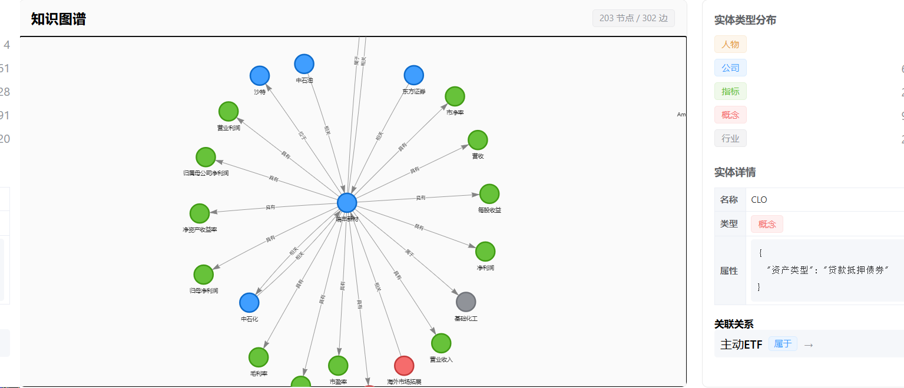

# FinanceWiki Agent · 金融投研知识库问答系统

> 一个轻量级金融投研 RAG Agent，基于三路召回检索（向量语义 + BM25 关键词 + 知识图谱），支持完整三层记忆架构 + 自动摘要压缩、多模型切换，以及文件型技能系统（Claude Code Skills 风格）。



---

## ✨ 核心特性

### 🎯 三路召回检索（Triple Retrieval）
- **向量语义检索**：Qdrant + 本地 BGE 中文 embedding
- **关键词检索**：jieba + BM25
- **知识图谱检索**：实体识别 + 关系抽取 + 子图扩展
- **RRF 融合排序**：三路结果加权融合 + 重排序

### 🧠 完整三层记忆 + 自动压缩
- **短期记忆**：当前会话的原文窗口 + 累积摘要
  - Redis 优先，内存降级，**SQLite (chat_history) 永久兜底回填**——重启/Redis 过期都不失忆
  - 摘要双写 `short_term_summaries` 表，Redis 挂了也不丢
- **中期记忆**：跨会话的相似问答召回（Qdrant `chat_memory` 集合 + 向量）
  - 召回时自动排除当前会话，避免与短期重复
  - 降级：Qdrant 不可用时用 `mid_term_qa` 表 SQL LIKE
- **长期记忆**：LLM 抽取的结构化用户事实（mem0 风格）
  - 类别：`preference` / `fact` / `identity`
  - 余弦相似度去重合并（≥0.92 视为同义，UPDATE 不增行）
- **自动摘要压缩**（参考 Claude Code / LangChain SummaryBuffer / MemGPT 递归摘要）
  - 上下文窗口统一 **200,000 tokens**（tiktoken `cl100k_base` 计数 + 启发式降级）
  - 触发线 **80%**（后台异步压缩，不阻塞回复）
  - 紧急线 **95%**（请求路径同步安全阀，单轮暴涨时立刻压缩）
  - 锚点：保留最近 3 轮原文 + LLM 生成结构化 JSON 摘要
  - 失败降级：LLM 异常 → 截断拼接，主流程不报错
  - 审计：每次压缩写入 `compression_events` 表，便于观测

### 📚 技能系统（Skills，渐进式披露）
- 每个技能 = `backend/skills/<name>/SKILL.md` 一个文件夹
- YAML frontmatter（`name/title/description/category/trigger_keywords/enabled`）+ Markdown 正文
- 三阶段注入到 system prompt：
  1. 始终注入"技能索引"（轻量，< 1k token）
  2. 关键词预筛挑出相关技能（jieba + 子串匹配）
  3. 按需加载选中技能的完整 instructions
- 预置 3 个示例技能：财务比率分析、估值汇总、研报摘要

### 📊 知识图谱
- 上传文档自动抽取实体（公司/指标/人物/行业/概念）
- 跨文档同名实体自动合并为单一节点
- vis-network 力导向图可视化

### 🤖 多模型支持
智谱 GLM-4 · DeepSeek · Kimi · MiniMax

### 💬 流式对话
- SSE 流式输出
- 会话历史持久化（SQLite）
- 自动重连机制

---

## 🛠️ 技术栈

| 层 | 技术 |
|---|---|
| 后端 | Python 3.10+, FastAPI, Uvicorn |
| 前端 | Vue 3, Element Plus, Pinia, vis-network |
| 向量库 | Qdrant |
| 缓存/队列 | Redis |
| 元数据存储 | SQLite |
| 知识图谱 | NetworkX |
| Embedding | BAAI/bge-large-zh-v1.5（本地）|
| Token 计数 | tiktoken (cl100k_base) + 字符启发式降级 |
| 分词 | jieba |

---

## 🚀 快速开始

### 1. 环境要求

- Python 3.10+
- Redis 7+（可选，挂了自动降级到内存 + SQLite 兜底）
- Qdrant 1.7+（可选，挂了自动降级到 SQL LIKE）
- Node.js 16+（前端开发时需要）

### 2. 启动依赖服务（Windows 一键脚本）

双击 `start_all.bat`，脚本会：
- 启动 Redis（端口 6379）
- 启动 Qdrant（HTTP 6333 / gRPC 6334）
- 等待端口探活后启动后端（端口 8000）

也可手动用 Docker：
```bash
docker-compose up -d
```

> **降级友好**：Redis / Qdrant 都可以不启动，系统会打印 warning 后继续运行（短期用内存+SQLite，中期用 SQL LIKE）。但长期记忆的 embedding 抽取会静默失败。

### 3. 安装 Python 依赖

```bash
pip install -r requirements.txt
```

### 4. 配置 API Key

复制 `.env.example` 为 `.env`，填入大模型 API Key：

```env
DEEPSEEK_API_KEY=sk-xxx
ZHIPU_API_KEY=
KIMI_API_KEY=
MINIMAX_API_KEY=
```

### 5. 启动后端

```bash
python -m uvicorn backend.main:app --host 0.0.0.0 --port 8000
```

首次启动会自动下载 embedding 模型到 `D:/models/`，并预热 bge-large-zh-v1.5。

### 6. 构建前端

```bash
cd frontend
npm install
npm run build
cd ..
```

构建产物 `frontend/dist/` 会被后端 `StaticFiles` 自动挂载。

### 7. 访问

- 🌐 应用：http://localhost:8000
- 📖 API 文档：http://localhost:8000/docs
- 🧩 技能管理：http://localhost:8000/skills
- 🧠 记忆状态：http://localhost:8000/api/chat/memory/stats

---

## 📁 项目结构

```
finance-agent/
├── backend/
│   ├── main.py                    # FastAPI 入口 + 路由注册 + SPA 挂载 + lifespan
│   ├── config.py                  # pydantic-settings 配置（含 MEMORY_* / COMPRESSION_*）
│   ├── database.py                # SQLite 初始化（含 4 张记忆表）
│   ├── api/                       # REST 路由
│   │   ├── chat.py                # 对话（流式 SSE）+ 会话管理 + memory stats
│   │   ├── documents.py           # 文档上传/解析/重处理
│   │   ├── models.py              # 模型配置 + 切换 + 测试
│   │   ├── knowledge_graph.py     # KG 聚合视图
│   │   └── skills.py              # 技能 CRUD（文件 IO）
│   ├── core/
│   │   ├── rag/
│   │   │   ├── retriever.py       # 三路召回 + RRF 融合
│   │   │   ├── vector_store.py    # Qdrant 封装（collection_name 可参数化）
│   │   │   ├── generator.py       # 响应生成（注入技能 + 三层记忆到 prompt）
│   │   │   └── skill_resolver.py  # 技能渐进式披露解析器
│   │   ├── skills/
│   │   │   └── scanner.py         # 文件扫描 + YAML frontmatter 解析
│   │   ├── knowledge_graph/       # KG 构建与检索
│   │   ├── memory/                # ★ 三层记忆 + 压缩
│   │   │   ├── short_term.py      # 短期：Redis/内存 + SQLite 回填 + 摘要双写
│   │   │   ├── mid_term.py        # 中期：Qdrant 向量召回 + SQL LIKE 兜底
│   │   │   ├── mid_term_store.py  # 中期向量库封装（collection=chat_memory）
│   │   │   ├── long_term.py       # 长期：LLM 抽取 + 余弦去重合并
│   │   │   ├── token_counter.py   # tiktoken + 字符启发式
│   │   │   ├── compressor.py      # 阈值判定 + 锚点切分 + LLM 摘要
│   │   │   └── manager.py         # 三层 facade + 双通道压缩
│   │   ├── cache/                 # 缓存（Redis/内存）
│   │   ├── llm/                   # 大模型基类 + 4 个 provider 实现
│   │   └── embedding/             # BGE 本地 embedding
│   ├── services/                  # 业务服务（文档解析）
│   ├── queue/                     # Redis 队列 producer/worker
│   └── skills/                    # ★ 技能文件夹（每技能一个目录 + SKILL.md）
│       ├── financial-ratio-analysis/SKILL.md
│       ├── valuation-summary/SKILL.md
│       └── research-report-summary/SKILL.md
├── frontend/
│   ├── src/
│   │   ├── views/                 # 页面：对话/文档/知识图谱/技能/设置
│   │   ├── stores/                # Pinia
│   │   ├── router/                # Vue Router
│   │   └── App.vue                # 侧边栏菜单
│   └── package.json
├── data/                          # SQLite DB + 文档（git 忽略）
├── logs/                          # 运行日志（git 忽略）
├── start_all.bat                  # Windows 一键启动脚本
├── docker-compose.yml             # Qdrant + Redis
├── requirements.txt
└── README.md
```

---

## 🧠 记忆系统详解

### 工作流（一次 10 轮对话为例）

```
第 1 轮：用户问 "我持有 1000 股茅台，现在该不该卖？"
  │
  ├─ 写入（异步后台）
  │   ├─ 短期：chat_history 原文 + short_term 窗口
  │   ├─ 中期：mid_term_qa + Qdrant 向量
  │   └─ 长期：LLM 抽取 → "用户持有 1000 股茅台" (fact, conf=0.9)
  │
  ├─ 召回（组装 prompt 前）
  │   ├─ 短期：当前会话原文
  │   ├─ 中期：跨会话相似问答（排除本会话）
  │   └─ 长期：用户偏好 + 已确认事实
  │
  └─ 组装 prompt
      System + 用户问题 + 相关文档 + 历史问答 + 长期记忆 + 本次上下文

第 2~9 轮：照常读写，三层记忆累积

第 10 轮：token 接近 160K (80%) → 后台触发压缩
  ├─ 切分：保留最近 3 轮原文（锚点） + 前 7 轮送 LLM
  ├─ LLM 生成结构化 JSON 摘要（user_intent / confirmed_facts / context_anchors ...）
  ├─ 持久化：摘要双写 Redis + SQLite，窗口只剩 6 条消息
  └─ 审计：INSERT compression_events (sid, 160K → 3.7K, 14 轮, 'background')
```

### 最终 prompt 结构

```
【System Prompt】
你是一个专业的金融投研助手...（含 Skills 索引）

【User Prompt】
用户问题：xxx

## 相关文档
[文档1] ...（来源：年报，相关度：0.92）

## 相关历史问答（来自其他会话，仅作参考）
[历史1] (相似度: 0.78)
问: 茅台估值贵不贵？
答: 从 PE 角度看...

## 长期记忆（用户偏好与已确认事实）
- [事实] 用户持有 1000 股茅台
- [偏好] 用户偏好长期持有

## 本次会话上下文
【此前对话摘要】
- 核心意图：用户评估茅台持仓是否该卖
- 已确认事实：持有 1000 股；考虑 1500 元加仓
- 上下文锚点：茅台、1500 加仓位

【最近对话原文】
用户: ...（第 8 轮）
助手: ...
用户: ...（第 9 轮）
助手: ...
用户: 现在美联储加息对我有什么影响？

请基于以上信息回答用户问题。
```

### 降级链（任何一环挂掉都不影响主流程）

| 组件不可用 | 行为 |
|---|---|
| tiktoken | 字符启发式计数（CJK×0.7 + 其他/4） |
| Redis | 短期走进程内存 dict + SQLite rehydrate + `short_term_summaries` 兜底摘要 |
| Qdrant | 中期走 `mid_term_qa` 表 SQL LIKE |
| LLM | 压缩降级为截断拼接；长期抽取静默跳过 |
| Embedding 模型 | 中期/长期写入与召回静默跳过，短期不受影响 |

---

## 🧩 技能系统使用说明

技能 = 一个文件夹 + 一个 `SKILL.md`：

```
backend/skills/
└── my-skill/
    └── SKILL.md
```

`SKILL.md` 格式：
```markdown
---
name: my-skill
title: 我的技能
description: 一句话说明这个技能做什么（AI 据此判断是否启用）
category: general         # analysis / writing / retrieval / general
trigger_keywords: [关键词1, 关键词2]
enabled: true
---

# 技能正文（Markdown）

## 适用场景
...

## 分析要点
...
```

**添加新技能有 3 种方式**：

1. **UI 方式**：访问 http://localhost:8000/skills，点"新建技能"
2. **API 方式**：`POST /api/skills`，body 是 `{name, content}`
3. **文件方式**：直接在 `backend/skills/` 下创建文件夹，刷新页面或调 `POST /api/skills/reload`

**预置 3 个技能**（不可删除）：财务比率分析、估值汇总、研报摘要。

---

## 🔌 API 接口速览

| 模块 | 端点 |
|---|---|
| 对话 | `POST /api/chat`（流式）, `GET /api/chat/history`, `GET/POST/DELETE /api/chat/sessions`, `POST /api/chat/sessions/recover-orphans` |
| 记忆 | `GET /api/chat/memory/stats`（三层记忆运行状态 + 可选 `?session_id=...`） |
| 文档 | `POST /api/documents/upload`, `GET /api/documents`, `DELETE /api/documents/{id}`, `POST /api/documents/{id}/reprocess` |
| 知识图谱 | `GET /api/knowledge-graph`（全局合并视图）, `GET /api/knowledge-graph/stats`, `GET /api/knowledge-graph/entity/{name}` |
| 模型 | `GET /api/models`, `POST /api/models/switch`, `POST /api/models/config/{provider}`, `POST /api/models/test/{provider}` |
| 技能 | `GET /api/skills`, `GET/POST/PUT/DELETE /api/skills/{name}`, `POST /api/skills/{name}/toggle`, `POST /api/skills/{name}/test`, `POST /api/skills/reload` |

完整 OpenAPI 文档：http://localhost:8000/docs

---

## ⚙️ 配置说明

### 环境变量（`.env`）

```env
# Embedding
EMBEDDING_PROVIDER=local      # local / zhipu / deepseek
EMBEDDING_MODEL=BAAI/bge-large-zh-v1.5
EMBEDDING_DIMENSION=1024

# Redis / Qdrant
REDIS_HOST=localhost
REDIS_PORT=6379
QDRANT_HOST=localhost
QDRANT_PORT=6333

# 检索
RETRIEVAL_TOP_K=10
CACHE_TTL=3600
```

### `config.py` 中的记忆/压缩配置（已内置默认）

```python
# 短期记忆
MEMORY_SHORT_TERM_TTL = 86400           # Redis 24h（SQLite 兜底永久）

# 中期记忆
MEMORY_MID_TERM_TOP_K = 5
MEMORY_MID_TERM_SCORE_THRESHOLD = 0.6
MEMORY_MID_TERM_SNIPPET_CHARS = 150

# 长期记忆
MEMORY_LONG_TERM_TOP_K = 5
MEMORY_LONG_TERM_DEDUP_THRESHOLD = 0.92  # 余弦 ≥ 0.92 视为同义
MEMORY_LONG_TERM_SNIPPET_CHARS = 100
MEMORY_ENABLE_LONG_TERM_EXTRACT = True   # 关掉可停用 LLM 抽取

# 上下文压缩
COMPRESSION_CONTEXT_WINDOW = 200_000     # 上下文窗口
COMPRESSION_TRIGGER_RATIO = 0.8          # 后台主通道
COMPRESSION_HARD_RATIO = 0.95            # 同步安全阀
COMPRESSION_ANCHOR_RECENT_TURNS = 3      # 锚点保留轮数
COMPRESSION_SUMMARY_MAX_TOKENS = 2000    # 摘要 token 上限
COMPRESSION_LLM_TEMPERATURE = 0.2
```

### Embedding 模型

默认本地 BGE-large-zh-v1.5（1024 维），首次运行自动下载到 `D:/models/`。
也可改为 API：`EMBEDDING_PROVIDER=zhipu/deepseek`。

---

## 🧠 设计要点

- **三层记忆真正可召回**：每一层都有独立的存储、独立的检索路径、独立的降级链
- **SQLite 是 source of truth**：Redis / Qdrant 任意一个挂掉都不影响主流程，重启/过期也不失忆
- **后台异步写 + 压缩**：用户不等 LLM 抽取、不等向量召回、不等摘要生成——所有重活都在回复返回后 fire-and-forget
- **单例化**：MemoryManager 进程级单例，Redis 连接与向量库实例全局共享，避免 per-request 实例化丢数据
- **per-session 锁**：并发请求同一会话不会重复压缩
- **压缩有损可控**：锚点 3 轮原文 + 结构化 JSON 摘要（数字/代码/日期/实体专门保留）
- **渐进式披露**：技能按需注入，token 占用与技能数量解耦
- **真正的增量**：DB 中每个文档独立存储实体/关系，API 层按 (name, type) 合并为全局图
- **流式优先**：对话用 SSE 流式输出，前端 fetch + ReadableStream 解析
- **离线友好**：Redis 不可用时自动降级到内存模式；Qdrant 不可用时同样
- **路由顺序保证**：`/api/*` 路由先于静态文件 catch-all 注册，避免 SPA 抢匹配

---

## 📄 License

MIT